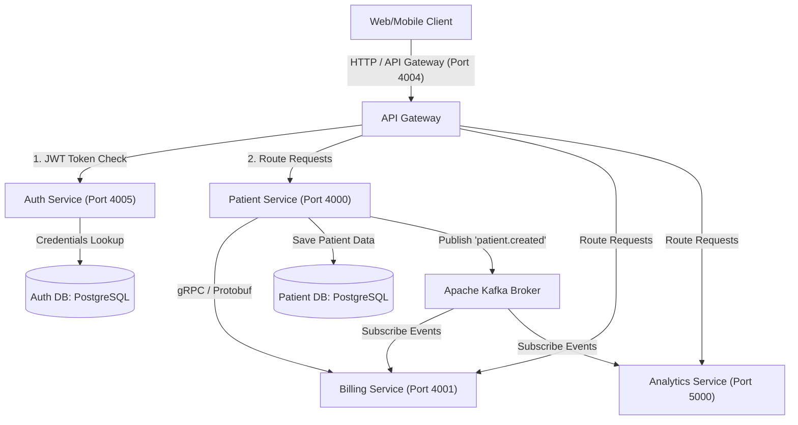

# Cloud-Native Patient Management System

A high-performance, secure, and event-driven microservices application designed for healthcare patient data orchestration, billing workflows, and analytics tracking. 

The project leverages a modern distributed system architecture with microservices communicating via **gRPC**, sharing events over **Apache Kafka**, and managed securely behind a **Spring Cloud API Gateway** with custom JWT security. The infrastructure is defined using **AWS CDK in Java** and emulated locally via **LocalStack**.

---

## 🏗️ System Architecture



---

## 🛠️ Technology Stack

* **Core Framework:** Java 21, Spring Boot 3.x, Spring WebFlux (Reactive Gateway)
* **Databases:** PostgreSQL (Isolated Database-per-Service pattern)
* **Inter-Service Communication:** gRPC, Protocol Buffers (Protobuf)
* **Event Streaming:** Apache Kafka (with ZooKeeper)
* **Infrastructure as Code (IaC):** AWS CDK (Cloud Development Kit in Java)
* **Local Cloud Emulation:** LocalStack Community Edition
* **Containerization:** Docker, Docker Compose
* **Security:** Stateless JWT authentication, BCrypt Password Hashing, Spring Security

---

## 📦 Microservices Directory

1. **`api-gateway`:** Reactive gateway router handling rate-limiting, route mapping, and centralized JWT authorization.
2. **`auth-service`:** Handles user registration, credentials hashing, and issuing signed JWT tokens.
3. **`patient-service`:** Core business logic for patient CRUD records. Fires Kafka events upon creation.
4. **`billing-service`:** Subscribes to patient creation events to initiate bill files. Exposes high-performance gRPC interfaces.
5. **`analytics-service`:** Subscribes to events to aggregate tracking metrics.
6. **`infrastructure`:** AWS CDK project in Java compiling cloud architectures (ECS Fargate, RDS PostgreSQL, MSK Kafka).

---

## 🚀 Getting Started

### Prerequisites
* Docker Desktop & Docker Compose
* Node.js (for AWS CDK Java JSII bridge)
* Java 21 JDK
* Maven 3.9+

### 1. Run via Docker Compose (Local Dev)
To launch the entire stack (services, databases, Kafka, and Zookeeper) locally:

```bash
# Build and start all containers in detached mode
docker compose up --build -d
```

Verify all services are running:
```bash
docker ps
```

### 2. Run AWS CDK Stack (LocalStack Cloud Emulation)
To test the AWS-emulated cloud deployment:

1. **Start LocalStack:**
   Open the LocalStack Desktop UI or run:
   ```bash
   localstack start -d
   ```
2. **Synthesize CDK Template:**
   Run the `main` method in `LocalStack.java` (found in the `infrastructure` directory) using your IDE or Maven to generate the templates in `cdk.out/`.
3. **Deploy Infrastructure:**
   ```bash
   # Deploy synthesized CloudFormation templates
   aws --endpoint-url=http://localhost:4566 cloudformation deploy \
       --stack-name patient-management \
       --template-file "infrastruture/cdk.out/localstack.template.json"
   ```

---

## 🧪 Testing with Postman

An automated Postman collection is located at:
`patient_management_postman_collection.json`

Import this file into Postman:
1. Hit **Register** to create a user profile.
2. Hit **Login** to get a JWT token.
3. The Postman Test Script will automatically extract the JWT token and save it to a collection variable (`{{jwt_token}}`).
4. Subsequent calls to **Get Patients** or **Create Patient** will automatically pass the authorization header.
